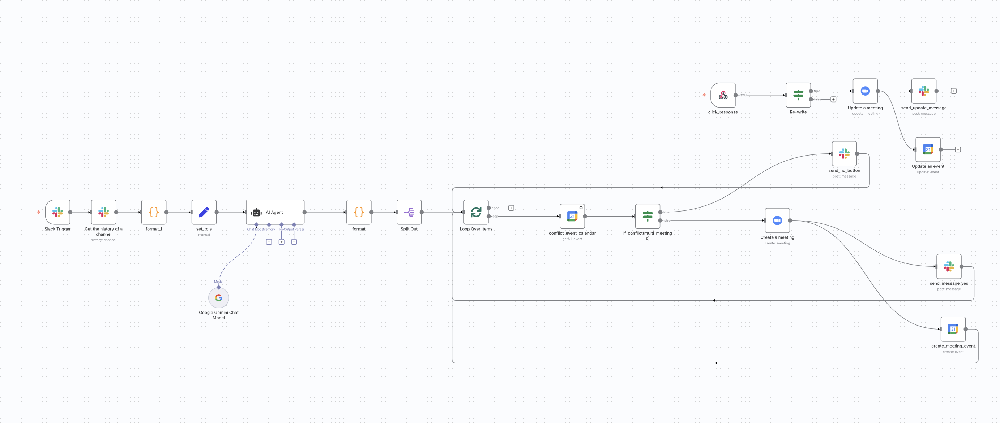

# Meeting Scheduling Agent

An intelligent agent that automates meeting scheduling by processing natural language from Slack messages using a Large Language Model (LLM).

***
## Overview

This project uses **n8n** to create a smart workflow that listens for mentions in a Slack channel. When activated, it reads the conversation, uses the **Google Gemini** LLM to understand requests, and then schedules, updates, or deletes meetings in **Google Calendar**. It is designed to handle scheduling conflicts by asking the user for input through interactive Slack buttons.

***
## ✨ Features

* **Natural Language Processing**: Leverages Google's Gemini 2.0 Flash model to understand meeting requests written in plain English.
* **Automated Calendar Management**: Can automatically **create**, **update**, or **delete** events on Google Calendar.
* **Conflict Detection**: Proactively checks for scheduling conflicts with existing events before creating a new meeting.
* **Interactive Conflict Resolution**: If a conflict is found, it sends an interactive message to Slack, allowing the user to **overwrite** an existing event or **dismiss** the new one.
* **Seamless Integration**: Connects directly with the Slack, Google Calendar, and Google AI APIs.

***
## ⚙️ How It Works

The automation is split between a main workflow and a sub-workflow for handling user responses.

### Main Workflow (Trigger: App Mention)

1.  **Activation**: A user activates the agent by mentioning the Slack app (e.g., `@MeetingAgent`) in a channel.
2.  **Data Collection**: The workflow collects recent messages from the channel.
3.  **LLM Processing**: The message history is formatted into JSON and sent to the **Gemini** model. The LLM extracts the user's intent and key meeting details (title, time, attendees).
4.  **Conflict Check**: The agent checks Google Calendar to see if the proposed meeting time conflicts with any existing events.
5.  **Action**:
    * **No Conflict**: The workflow creates a new meeting, schedules it on Google Calendar, and sends a confirmation message to the Slack channel.
    * **Conflict Found**: The workflow sends a message to Slack with two buttons: "**Re-write Event**" and "**Dismiss New Meeting**".

### Sub-Workflow (Trigger: Button Click)

1.  **Activation**: This workflow is triggered when a user clicks one of the buttons from the conflict message.
2.  **Resolution**: If the user chose "Re-write Event," the workflow updates the Google Calendar event and sends a final confirmation message to Slack. If "Dismiss" was chosen, no action is taken.

***
## 🛠️ Tech Stack

* **Automation**: **n8n**
* **Chat & Triggers**: **Slack** (App Mentions, Interactive Buttons)
* **Calendar**: **Google Calendar API**
* **AI / Language Model**: **Google Gemini 2.0 Flash**
